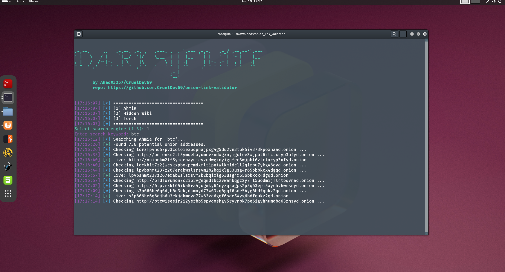
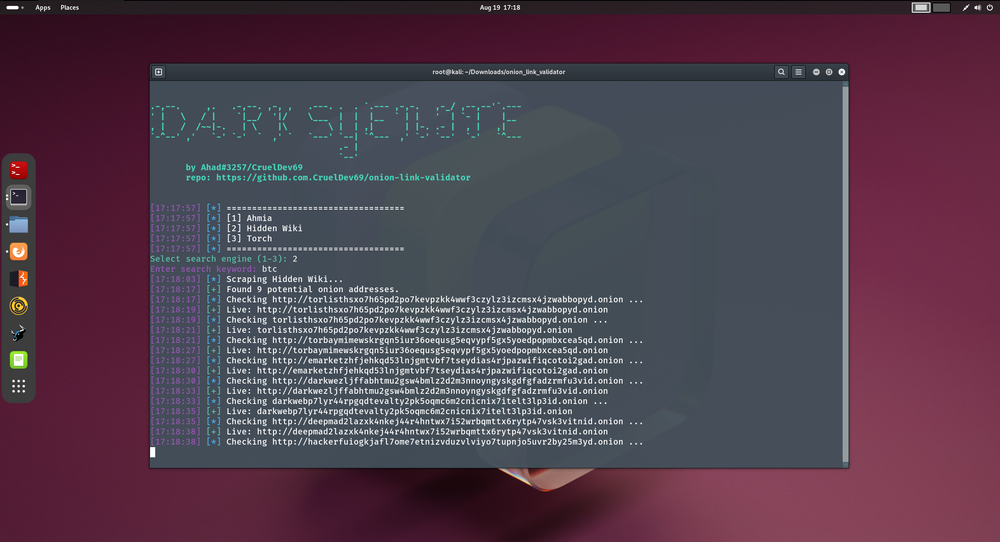
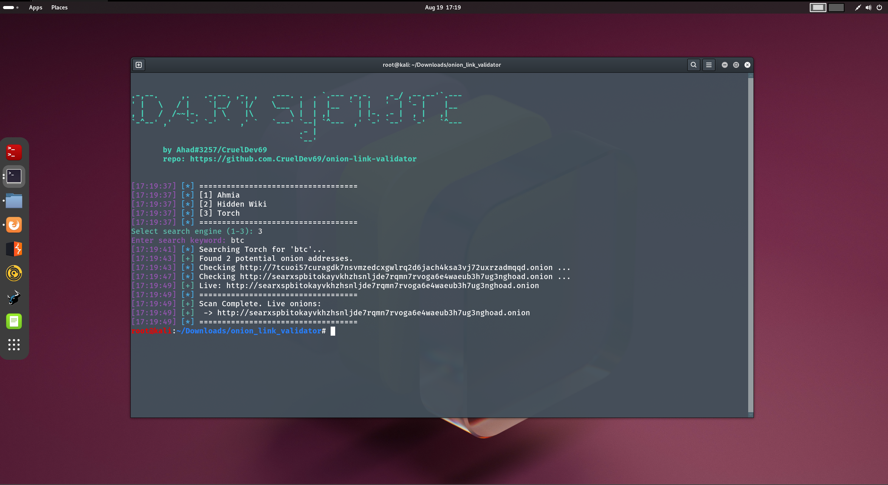

````markdown
# 🕵️ Onion Link Validator

A Python tool to discover `.onion` hidden services by scraping popular indexes such as **Ahmia**, **Hidden Wiki**, and **Torch**.  
Useful for research, OSINT, and darknet exploration.

---

## ✨ Features
- 🔎 Scrapes multiple onion directories
- 📌 Collects and lists `.onion` URLs
- ⚡ Lightweight and easy to extend
- 🐍 Pure Python (no heavy dependencies)

---

## 📦 Installation
Clone the repository and install requirements:

```bash
git clone https://github.com/CruelDev69/onion-link-validator.git
cd onion-link-validator
pip install -r requirements.txt
```

---

## ⚙️ Tor Setup

This project requires **Tor** to be installed and running.  
We recommend using the **Tor Expert Bundle** (not the browser):

- 🔗 [Download Tor Expert Bundle](https://www.torproject.org/download/tor/)  
- Extract and run `tor.exe` (Windows) or `tor` (Linux/macOS).  
- Default SOCKS proxy: `127.0.0.1:9050`

```bash
tor
```

---

## 🚀 Usage

Run the scraper:

```bash
python main.py
```

Example output:

```
[16:47:38] [+] Found 15 potential onion addresses.
[16:47:38] [*] ===================================
[+] Scan Complete. Live onions:
- http://exampleonion123.onion
- http://anotherhiddenlink.onion
```

---

## ⚠️ Common Errors

* `RemoteDisconnected`: Target onion service refused the connection.
* `415 Client Error: Unsupported Media Type`: Some sites reject default headers.
  👉 Try adding custom `User-Agent` and `Accept` headers in the scraper.

---

## 📸 Screenshots

  



---

## 🛡️ Disclaimer

This project is for **educational and research purposes only**.  
The author does **not condone or encourage illegal activity**.  
Use responsibly — you are solely responsible for how you use this tool.

---

## ⭐ Contribute

Pull requests are welcome! If you’d like to add more onion directories or improve scraping logic, feel free to open an issue or PR.

---

## 📜 License

MIT License © 2025 [Ahad](https://github.com/CruelDev69)
````
